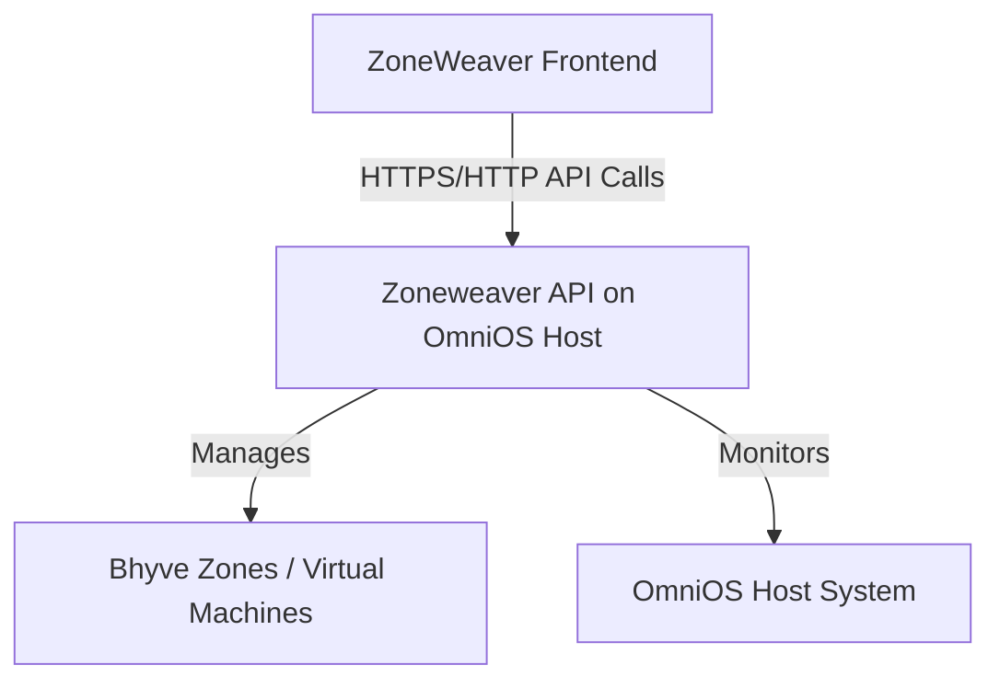

# Zoneweaver API

**Zoneweaver API** is a powerful, Node.js-based API server designed for comprehensive management of Bhyve virtual machines on the OmniOS operating system. It serves as the backbone of the Zoneweaver ecosystem, providing a secure and robust RESTful API for all your virtualization needs.

## Overview

Zoneweaver API is the essential link between your Bhyve hypervisor and the ZoneWeaver frontend. It exposes a rich set of API endpoints that allow for seamless control over virtual machines, detailed system monitoring, and secure, token-based authentication.

### Key Features

-   **Advanced API Key Authentication**: A secure, flexible authentication system with bcrypt-hashed keys and detailed audit trails.
-   **Comprehensive Zone Management**: Full control over Bhyve virtual machines, including creation, deletion, and state management.
-   **In-Depth System Monitoring**: Real-time statistics for CPU, memory, storage, and network performance.
-   **Multi-Database Support**: Seamless integration with SQLite, PostgreSQL, and MySQL/MariaDB.
-   **Auto-Generated API Documentation**: Interactive and up-to-date API documentation powered by Swagger/OpenAPI.
-   **Robust CORS Protection**: Whitelist-based Cross-Origin Resource Sharing to secure your API from unauthorized access.
-   **Full SSL/TLS Support**: Optional HTTPS for secure communication, with easy certificate management.

### Architecture

## Core Components

-   **`controllers`**: Contains the core business logic for handling API requests, managing services, and orchestrating data collection.
-   **`models`**: Defines the database schemas for all application data, including zones, hosts, and API keys.
-   **`routes`**: Maps all API endpoints to their corresponding controller functions.
-   **`lib`**: Includes utility modules and libraries, such as the `ServiceManager` for interacting with the Solaris Service Management Facility (SMF).
-   **`middleware`**: Houses all custom middleware, including the API key verification logic.

## Quick Start

1.  **Setup**: Follow the detailed instructions in the [Installation Guide](https://zoneweaver-api.startcloud.com/docs/guides/production-installation/) to get your environment ready.
2.  **Bootstrap**: Generate your first API key using the secure bootstrap endpoint.
3.  **Configure**: Customize your server settings in `config/config.yaml`.
4.  **Connect**: Integrate with the ZoneWeaver frontend or start using the API directly.

## Documentation

📚 **Complete documentation is available at: [zoneweaver-api.startcloud.com](https://zoneweaver-api.startcloud.com/)**

-   **[Getting Started Guide](https://zoneweaver-api.startcloud.com/docs/guides/getting-started/)**: Quick start and setup instructions
-   **[Installation Guide](https://zoneweaver-api.startcloud.com/docs/guides/production-installation/)**: Complete installation guide for production
-   **[Configuration Reference](https://zoneweaver-api.startcloud.com/docs/configuration/)**: Detailed configuration options
-   **[API Reference](https://zoneweaver-api.startcloud.com/docs/api/)**: Interactive OpenAPI documentation
-   **[Authentication Guide](https://zoneweaver-api.startcloud.com/docs/guides/authentication/)**: API key setup and usage

## System Requirements

-   **Operating System**: OmniOS (with plans for future FreeBSD support)
-   **Node.js**: Version 16 or higher
-   **Hypervisor**: Bhyve, with full zone management capabilities

## Contributing

The Zoneweaver API is a key component of the Zoneweaver ecosystem, and we welcome all contributions. Whether you're fixing a bug, adding a new feature, or improving the documentation, your help is greatly appreciated.

## License

This project is licensed under the GPL-3.0 License. See the `LICENSE` file for more details.
