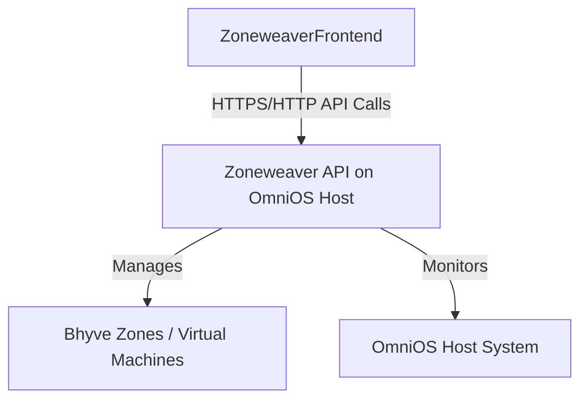

# ZoneweaverAPI Documentation
{: .fs-9 }

Node.js API backend for Zoneweaverzone hypervisor management. Provides RESTful API for managing Bhyve virtual machines, networking, storage, and system monitoring on OmniOS/illumos.
{: .fs-6 .fw-300 }

[Get started now](#getting-started){: .btn .btn-primary .fs-5 .mb-4 .mb-md-0 .mr-2 }
[View API Reference](docs/api/){: .btn .fs-5 .mb-4 .mb-md-0 }
[View on GitHub](https://github.com/Makr91/zoneweaver-api){: .btn .fs-5 .mb-4 .mb-md-0 }

---

## Getting started

ZoneweaverAPI is the backend component of the Zoneweaverzone management system. It provides a comprehensive RESTful API for managing Bhyve virtual machines, networking, storage, and system monitoring on OmniOS/illumos systems.

### Key Features

- **Zone Management**: Complete lifecycle management of Bhyve zones
- **Network Management**: VLAN, VNIC, and etherstub configuration
- **Storage Management**: ZFS dataset and pool management  
- **VNC Console Access**: Web-based console access to zones
- **API Key Authentication**: Secure API access with bearer tokens
- **Real-time Monitoring**: System metrics and zone status monitoring
- **Package Management**: Automated provisioning and updates

### Architecture

### Quick start

1. **Installation**: Install via OmniOS package or build from source
2. **Configuration**: Configure settings in `/etc/zoneweaver-api/config.yaml`
3. **API Key**: Generate API key via bootstrap endpoint or configuration
4. **Integration**: Connect your frontend or tools using the RESTful API

### API Documentation

The ZoneweaverAPI provides comprehensive OpenAPI 3.0 documentation:

- **[Interactive API Reference](docs/api/)** - Complete API reference with examples
- **[Getting Started Guide](docs/guides/getting-started/)** - Step-by-step setup instructions  
- **[Authentication Guide](docs/guides/authentication/)** - API key setup and usage
- **[Configuration Reference](docs/reference/configuration/)** - Complete configuration options

---

## About the project

ZoneweaverAPI is &copy; 2025 by the ZoneweaverProject.

### License

ZoneweaverAPI is distributed by an [GPL-3.0 license](https://github.com/Makr91/zoneweaver-api/blob/main/LICENSE.md).

### Contributing

When contributing to this repository, please first discuss the change you wish to make via issue, email, or any other method with the owners of this repository before making a change. Read more about becoming a contributor in [our GitHub repo](https://github.com/Makr91/zoneweaver-api#contributing).

#### Thank you to the contributors of ZoneweaverAPI!

<ul class="list-style-none">

  <li class="d-inline-block mr-1">
     
  </li>

</ul>

### Code of Conduct

ZoneweaverAPI is committed to fostering a welcoming community.

[View our Code of Conduct](https://github.com/Makr91/zoneweaver-api/tree/main/CODE_OF_CONDUCT.md) on our GitHub repository.
